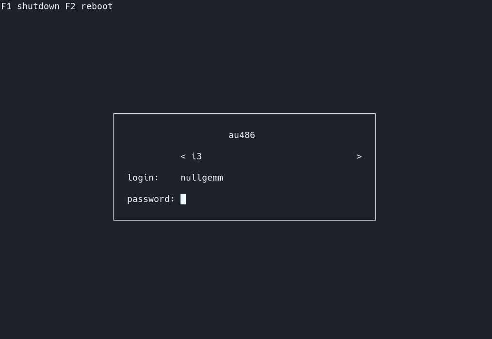
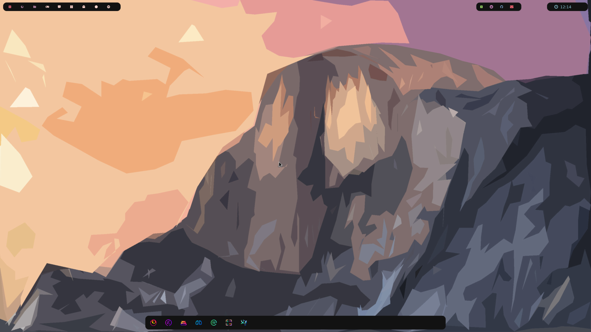
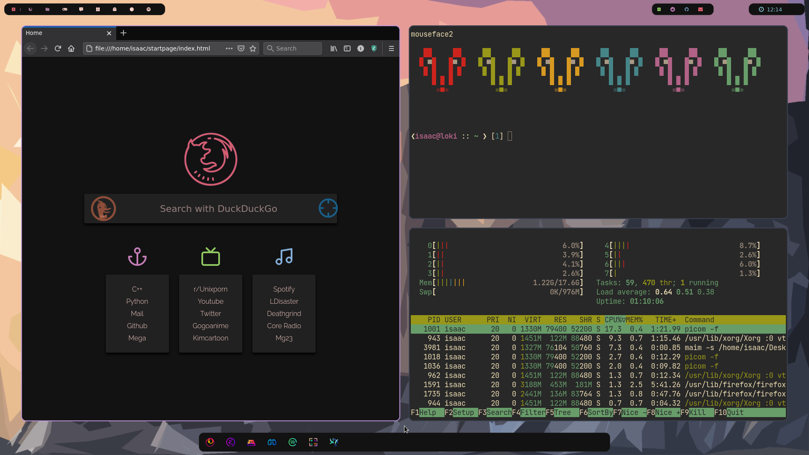
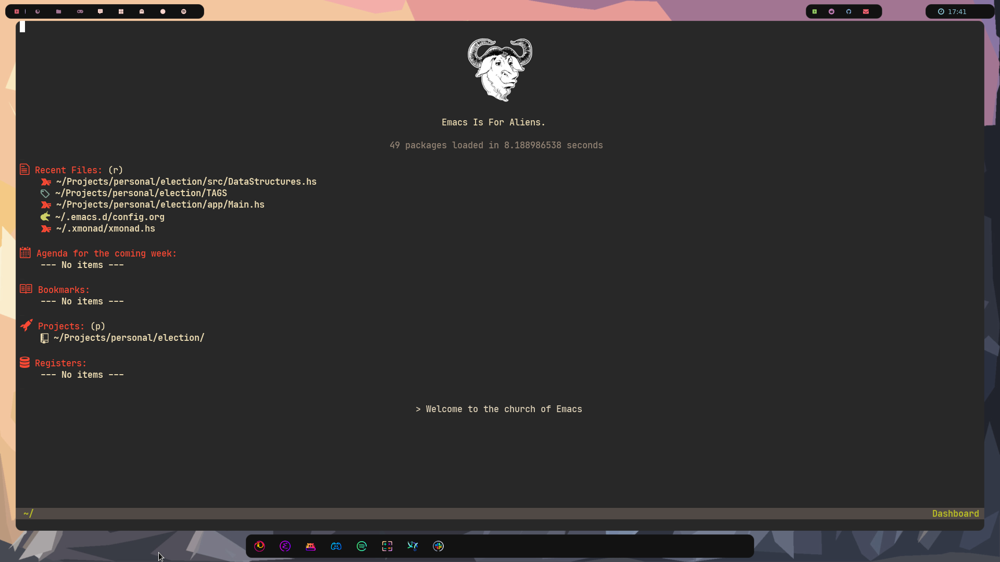
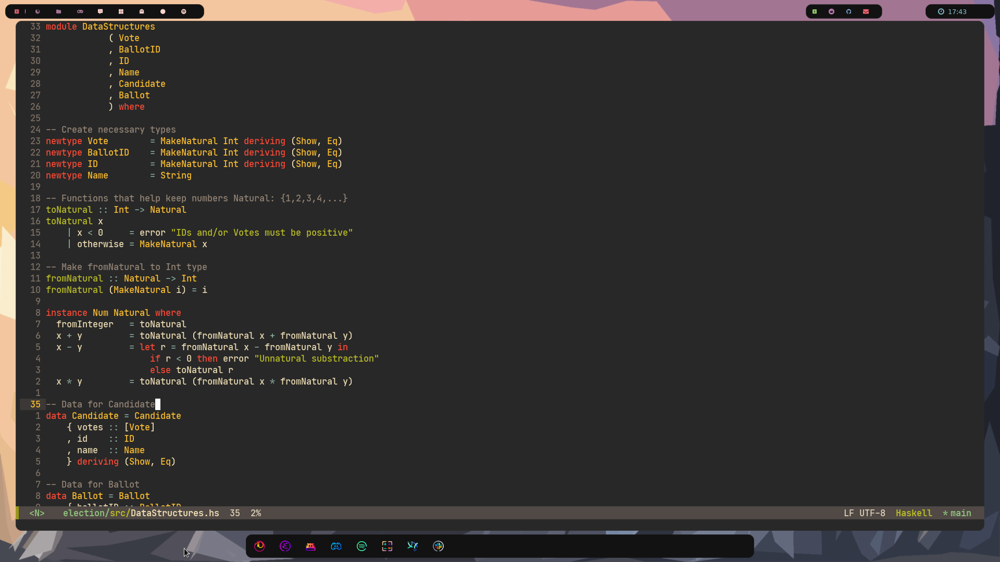

# Dotfiles! This is for Debian
Please check out for Gentoo and/or Arch based on [Axarva's Repo](https://github.com/Axarva/dotfiles-2.0)
### Login (pic by [ly](https://github.com/nullgemm/ly))

### Rest  of UI
   
 

# Table of Contents

1.  [Debian Image **For me only**](#orgc99c82b)
    1.  [Install necessary firmware](#org33763dc)
    2.  [Download Debian Buster](#orgd462edf)
    3.  [Install Necessary software](#org3fc492e)
2.  [Get my repo](#orgb65244a)
3.  [ZSH](#org0aab58a)
4.  [Fonts](#org91f56dd)
5.  [Kitty](#orgd18c26a)
6.  [Ly](#orgcdcd60d)
7.  [Haskell with Cabal](#orgaecc1a0)
8.  [XMonad, Rofi, Tint2 and Dunst](#org23896f6)
    1.  [Basic XMonad config](#org52d4283)
    2.  [Dependencies](#org721a24f)
    3.  [Tint2 Fork](#org5fa76f3)
    4.  [Candy icons](#org440ba44)
    5.  [Picom](#orgfa88bf1)
9.  [Firefox](#org0c6800b)
    1.  [Instalation probably with macosx](#org5a91b4f)
10. [Spotify](#orgbe1eee7)
    1.  [Deb repos](#orgd7d4c50)
    2.  [Install](#org5d6b0e4)
11. [Binaries](#orga58d213)
12. [Eww](#org6fae50c)
    1.  [First install rustup](#org88641db)
    2.  [Then install dependencies, nightly and eww](#org0ef1eb1)
13. [Get icons](#org4f82116)
    1.  [Add change .desktop icons](#orga03c1c4)
14. [Emacs](#org2229632)

# Debian Image **For me only**

I need to install Linux's new Kernel because of my system

## Install necessary firmware

Links:
[Debian Image](https://cdimage.debian.org/debian-cd/current/amd64/iso-cd/debian-10.9.0-amd64-netinst.iso)
[Wifi-Firmaware](https://packages.debian.org/buster/all/firmware-brcm80211/download)
[AMD Graphics](https://packages.debian.org/buster/all/firmware-brcm80211/download)

## Download Debian Buster

After graphical install move to Unstable-Testing in order to get
kernel 5.9.0-1-amd64.
Add the sources list:

    cd /etc/apt/
    rm sources.list
    touch sources.list
    echo "
    deb http://ftp.us.debian.org/debian/ testing main contrib non-free
    deb-src http://ftp.us.debian.org/debian/ testing main contrib non-free
    deb http://ftp.us.debian.org/debian/ testing-updates main contrib non-free
    deb-src http://ftp.us.debian.org/debian/ testing-updates main contrib non-free
    # deb http://deb.debian.org/debian-security testing/updates main contrib non-free
    # deb-src http://deb.debian.org/debian-security testing/updates main contrib non-free
    
    # This system was installed using small removable media
    # (e.g. netinst, live or single CD). The matching deb cdrom
    # entries were disabled at the end of the installation process.
    # For information about how to configure apt package sources,
    # see the sources.list(5) manual.
    deb http://deb.debian.org/debian/ experimental main
    " >> sources.list
    apt update && apt full-upgrade

## Install Necessary software

    apt-get install sudo
    visudo # Add isaac to users

    sudo reboot
    uname -r # Expect linux-5.10-amd64
    # Now let us start
    sudo apt-get update && sudo apt-get upgrade
    sudo apt-get install xorg git build-essential libpam0g-dev libxcb-xkb-dev kitty openssh-server curl wget zsh cmake network-manager feh
    sudo apt-get install libcairo2-dev libpango1.0-dev libglib2.0-dev libimlib2-dev libgtk2.0-dev libxinerama-dev libx11-dev libxdamage-dev libxcomposite-dev libxrender-dev libxrandr-dev librsvg2-dev libstartup-notification0-dev
    sudo apt-get update && sudo apt-get upgrade

# Get my repo

    git clone https://github.com/isaac025/dotfiles

# ZSH

    sh -c "$(curl -fsSL https://raw.github.com/ohmyzsh/ohmyzsh/master/tools/install.sh)"
    cp old.zshrc $HOME/.zshrc
    cp dotfiles/isaac.zsh-theme .oh-my-zsh/themes/

# Fonts

    mkdir .local/share/
    cp -r dotfiles/fonts .local/share/

# Kitty

    cp -r dotfiles/config ./.config

# Ly

    git clone https://github.com/nullgemm/ly.git
    make github
    make
    sudo make run
    sudo make install
    sudo systemctl enable ly.service

# Haskell with Cabal

    sudo apt-get install haskell-platform

# XMonad, Rofi, Tint2 and Dunst

    sudo apt-get install xmonad libghc-xmonad-contrib-dev rofi dunst

## Basic XMonad config

    mkdir .xmonad
    cp dotfiles/xmonad.hs ~/.xmonad/
    xmonad --recompile

## Dependencies

    sudo apt-get install brightnessctl playerctl doas jq maim mpv xclip # probably need --fix-missing flag

## Tint2 Fork

    git clone https://github.com/Axarva/tint2-1.git tint2
    cd tint2
    mkdir build
    cd build
    cmake ..
    make -j4

## Picom

    sudo apt-get install libxext-dev libxcb1-dev libxcb-damage0-dev libxcb-xfixes0-dev libxcb-shape0-dev libxcb-render-util0-dev libxcb-render0-dev libxcb-randr0-dev libxcb-composite0-dev libxcb-image0-dev libxcb-present-dev libxcb-xinerama0-dev libxcb-glx0-dev libpixman-1-dev libdbus-1-dev libconfig-dev libgl1-mesa-dev libpcre2-dev libpcre3-dev libevdev-dev uthash-dev libev-dev libx11-xcb-dev libdbus-1-dev libconfg-dev uthash-dev libxcb-glx0-dev libxcb-present-dev libxcb-xinerama0-dev libxcb-render-util0-dev libxcb-image0-dev libxcb-damage0-dev libxcb-randr0-dev libxcb--dev xcb libxcb-sync-dev libxcb-composite0-dev libxcb-composite0-dev
    sudo apt-get install ninja-build meson
    git clone https://github.com/ibhagwan/picom
    cd picom
    git submodule update --init --recursive
    meson --buildtype=release . build
    ninja -C build
    sudo ninja -C build install

# Firefox
    echo "deb http://deb.debian.org/debian/ unstable main contrib non-free" | sudo tee /etc/apt/sources.list
    sudo touch /etc/apt/sources.list.d/99pin-unstable
    echo "Package: *
    Pin: release a=stable
    Pin-Priority: 900

    Package: *
    Pin release a=unstable
    Pin-Priority: 10" | sudo tee /etc/apt/sources.list.d/99pin-unstable
    
    sudo apt update
    sudo apt install -t unstable firefox
    

# Spotify
    echo deb http://repository.spotify.com stable non-free | sudo tee /etc/apt/sources.list.d/spotify.list
    sudo apt update
    sudo apt install spotify-client

## Deb repos

    curl -sS https://download.spotify.com/debian/pubkey_0D811D58.gpg | sudo apt-key add - 
    echo "deb http://repository.spotify.com stable non-free" | sudo tee /etc/apt/sources.lis.d/spotify.list

## Install

    sudo apt-get update && sudo apt-get install spotify-client # Maybe --fix-missing

# Binaries

    cp -r dotfiles/bin ~

# Eww

## First install rustup

    curl --proto '=https' --tlsv1.2 -sSf https://sh.rustup.rs | sh

## Then install dependencies, nightly and eww

    rustup install nightly
    sudo apt-get install libgtk-3-dev
    git clone https://github.com/elkowar/eww
    cd eww
    cargo build --release
    cd target/release
    chmod +x ./eww
    ./eww daemon
    cp eww ~/bin

# Get icons

    mkdir ~/.themes
    cp -r dotfiles/candy-icons ~/.themes

## Add change .desktop icons

In order to get the candy icons we have to change
the .desktop files of our apps
Here  is an example for emacs:

    sudo vi /usr/share/applications/emacs.desktop

****Go to Icon Line****
E.g. *Icon=emacs* change to *Icon=/home/name\\./themes/candy-icons/apps/scalable/emacs.svg

****MIND THE ESCAPE SEQUENCE ON THE DOT****

# Emacs

    apt-get install emacs 
    cp -r dotfiles/.emacs.d ~

